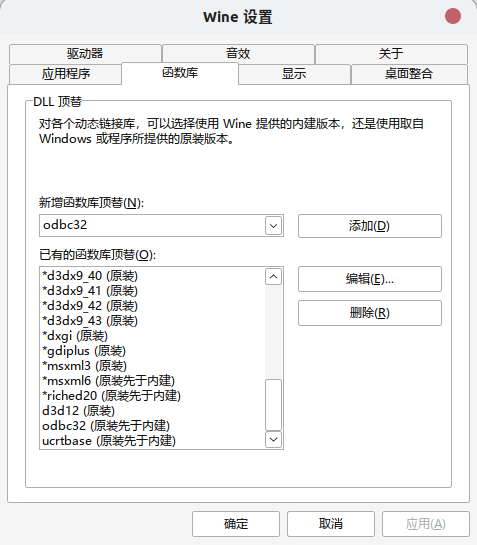

# Photoshop-2021-CC-Linux

**免责声明：**
**请仅在您拥有有效的 Photoshop 订阅时使用此软件。对于未订阅而产生的任何使用情况，本人概不负责。**

本程序所用到的工具和资源，关注以下公众号，回复“**linuxps**”获取：


本程序是在Linux上配置 wine 运行，配置后运行效果和在Windows上一模一样，可以充分使用显卡加速，运行稳定，可在生产环境中使用。

1. 在当前文件夹内打开终端，运行以下脚本即可：

```
sh install.sh
```

同样也提供了卸载脚本，终端运行：

```bash
sh uninstall.sh
```

下载`AdobePhotoshop2021.tar.xz`、`allredist.tar.xz`，并解压到 Adobe Photoshop 2021 文件夹中。 

2. 中文字体安装：

```bash
sh ./zh_cn_install.sh
```

打开wine设置，在函数库中添加 “odbc32、ucrtbase“函数库

```bash
WINEPREFIX=~/Adobe-Photoshop winecfg
```



## PS依赖的程序

- wine >=6.1 (Avoid 6.20 to 6.22)
- zenity
- appmenu-gtk-module
- tar
- wget
- curl
- All R/W rights on your home folder and the installer folder
- Vulkan capable GPU or APU
